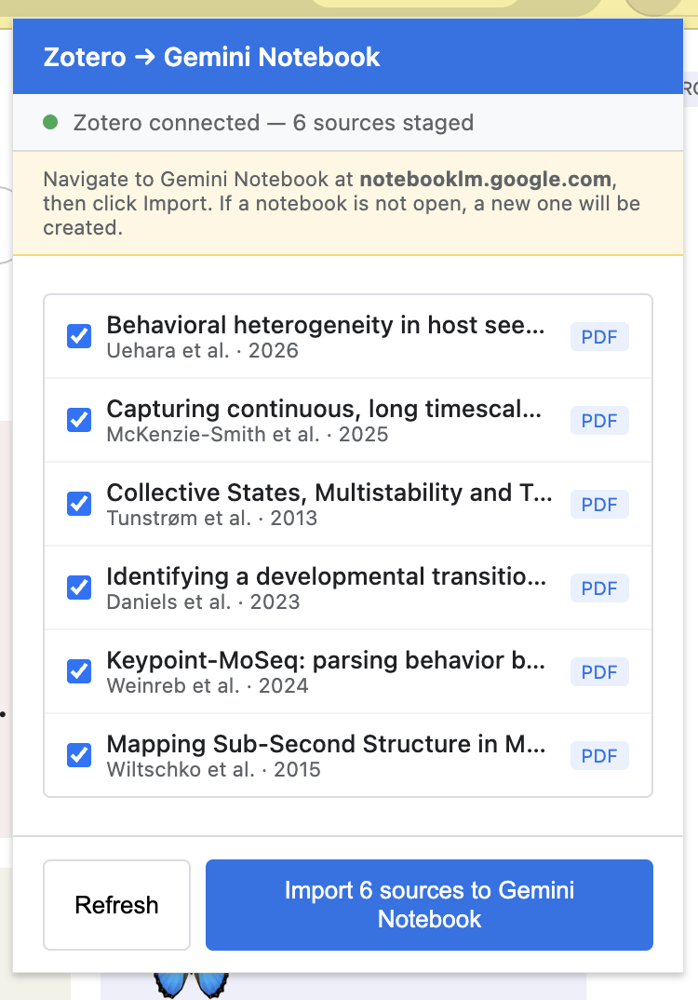

# Zotero → Gemini Notebook

> Google renamed NotebookLM to Gemini Notebook in July 2026. This project was
> formerly called Zotero → NotebookLM; existing installations and legacy
> integration identifiers remain supported.

> **Updated for Zotero 9:** Compatibility is fixed and upload compatibility is improved. If you
> installed an earlier copy of the Chrome extension, download the latest release
> and reload the Chrome extension from the new release package.

Want an easier way to build notebooks in Gemini Notebook from Zotero files on
your computer? This connector lets you browse your Zotero collections, stage
source files, and send them to Gemini Notebook without manually digging through
Zotero's filesystem.

While the direct interface with the browser window is tricky to make perfect,
we've made an effort to make the upload of Zotero articles to the web as
seamless as possible.

<p align="center">🌴 🌴 🌴</p>

<p align="center">
  
</p>

## Why

Zotero stores PDFs in opaque, key-based folder names. Manually gathering files
from a subcollection and uploading them to Gemini Notebook is tedious and
error-prone. This tool automates the handoff: browse your collections in
Zotero, pick your sources, and push them to Gemini Notebook.

## How It Works

The system has two parts:

1. **Zotero Plugin** — Adds an "Export to Gemini Notebook" dialog to Zotero's
   Tools menu. Browse your collection tree, search/filter items, and select
   which sources to stage. The plugin starts a local HTTP server that serves
   only the staged files.

2. **Chrome Extension** — Connects to the Zotero plugin's local server, fetches
   the staged files, and uploads them into Gemini Notebook.

## Installation

For normal use, install from the latest GitHub release. You do not need Node.js
or pnpm unless you are building from source.

### Download

1. Open the
   [latest release](https://github.com/peterdresslar/zotero-gemini-notebook/releases/latest).
2. Download both release assets. The current release retains the former
   NotebookLM filenames:
   - `zotero-notebook-lm.xpi`
   - `zotero-notebooklm-chrome-extension.zip`
3. Unzip `zotero-notebooklm-chrome-extension.zip` somewhere you can keep it.
   Chrome loads the extension from that folder, so do not delete it after
   installation.

If there is not a published release yet, use the source build steps below.

### Install the Zotero Plugin

1. Open Zotero.
2. Go to **Tools → Add-ons**.
3. Click the gear icon and choose **Install Add-on From File...**.
4. Select `zotero-notebook-lm.xpi`.
5. Restart Zotero if prompted.

### Install the Chrome Extension

1. Open `chrome://extensions/` in Chrome.
2. Enable **Developer mode**.
3. Click **Load unpacked**.
4. Select the unzipped Chrome extension folder. It should be the folder that
   contains `manifest.json`.
5. Optional: pin **Zotero → Gemini Notebook** to your Chrome toolbar.

To update the Chrome extension later, download the latest release, unzip the new
Chrome extension package, then use **Reload** on `chrome://extensions/`.

### Source Build

Use this path only if you want to build the project locally.

Prerequisites:

- Node.js 22+
- pnpm
- Git
- Zotero 7, 8, or 9
- Chrome or another Chromium browser that can load unpacked extensions

From the repository root:

```bash
pnpm install --frozen-lockfile
pnpm run package:release
```

The generated install files are:

```text
.scaffold/build/zotero-gemini-notebook.xpi
.scaffold/build/zotero-gemini-notebook-chrome-extension.zip
```

Install those files using the same Zotero and Chrome steps above.

## Usage

### Step 1: Stage Sources in Zotero

1. Open Zotero and go to **Tools → Export to Gemini Notebook...**
2. Browse the collection tree on the left to find your subcollection
3. Use the search box to filter items by title, author, or year
4. Click items to select them (checked items will be exported). Items without a valid PDF attachment are greyed out.
5. Click **Export to Gemini Notebook** to stage the selected files

### Step 2: Import into Gemini Notebook

1. Open [Gemini Notebook](https://notebooklm.google.com) in Chrome. You may open
   an existing notebook, or start from the main page and let the extension
   create a new notebook.
2. Click the Zotero → Gemini Notebook extension icon in your Chrome toolbar
3. The popup will show your staged sources with a green "Zotero connected" indicator
4. Click **Import to Gemini Notebook**
5. The extension will fetch each file from Zotero, then upload them all to
   Gemini Notebook's sources panel.

### Tips

- Keep Zotero running while importing — the Chrome extension fetches files from
  Zotero's local server.
- You can deselect items in the Chrome popup if you change your mind
- After a successful import, staged items are automatically cleared
- Keep the Gemini Notebook tab open until the import starts.
- If the import does not start, use **Add sources** in Gemini Notebook to open the
  file dialog, then click **Upload files**.
- If the import fails, refresh the Gemini Notebook tab and try again.

## Development

Use the source build command above to produce release-style install files.

During Chrome-extension development, you can load `chrome-extension/` directly
in `chrome://extensions/` and click **Reload** after editing extension files.

Before opening a PR, run:

```bash
pnpm run build
pnpm run lint:check
```

## Known Issues

- Large batches may take longer to start because Gemini Notebook creates its
  upload controls asynchronously.
- Gemini Notebook's DOM structure may change without notice, which could break
  the upload mechanism.

## License

MIT — see [LICENSE](LICENSE).
