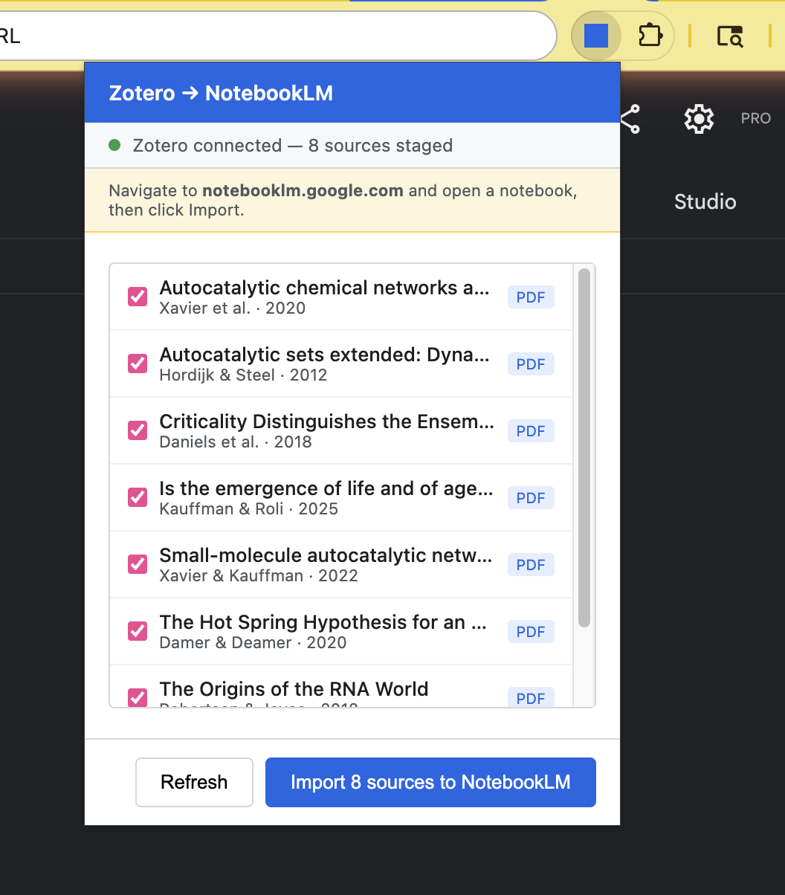

# Zotero → NotebookLM

I use [Zotero](https://www.zotero.org/) as my source of truth for **all** my scientific literature, and whenever I look into a new topic, it starts with a new collection of the latest papers in Zotero. My favorite workflow:

- take those new papers-->
- dump them into a new [NotebookLM](https://notebooklm.google.com/) notebook-->
- generate a audio "podcast"-->
- and off to my favorite jogging trail with headphones!

Unfortunately, there's no native integration between Zotero and NotebookLM, and--what's worse--Zotero's article storage on a local file system is an utter pain to navigate, select from, and use from the NotebookLM interface's file dropzone. So, I built this plugin to automate the workflow.

It's a bit of a kludge: NotebookLM only offers an API to business customers as of this time, and so we have to manipulate the web interface using a browser extension. This arrangement likely means that the overall setup is a bit brittle! But, as I _need_ to use it many times a week (what else am I going to listen to when I am huffing up [Puʻu Pia](https://maps.app.goo.gl/56yaE2tURJyo24Ma6)?), I am likely to invest the time to try and keep this project maintained---and I'd welcome requests and contributions.

<p align="center">🌴 🌴 🌴</p>

<p align="center">
  
</p>

## About

A Zotero 7 plugin and Chrome extension that lets you select articles from your Zotero library and import their PDFs directly into Google NotebookLM — no manual file wrangling required.

## Why?

Zotero stores PDFs in opaque, key-based folder names. Manually gathering files from a subcollection and uploading them to NotebookLM is tedious and error-prone. This tool automates the entire workflow: browse your collections in Zotero, pick your sources, and push them to NotebookLM with two clicks.

## How It Works

The system has two parts:

1. **Zotero Plugin** — Adds an "Export to NotebookLM" dialog to Zotero's Tools menu. Browse your collection tree, search/filter items, and select which sources to stage. The plugin starts a local HTTP server that serves the staged files.

2. **Chrome Extension** — Connects to the Zotero plugin's local server, fetches the staged files, and injects them into NotebookLM's upload interface.

## Installation

There is not yet a published release package. For now, install from a local
source checkout.

### Prerequisites

- Node.js
- pnpm
- Zotero 7 or 8
- Chrome or another Chromium browser that can load unpacked extensions

### Build the Zotero Plugin

From the repository root:

```bash
pnpm install --frozen-lockfile
pnpm run build
```

The built Zotero plugin is written to:

```text
.scaffold/build/zotero-notebook-lm.xpi
```

### Zotero Plugin

1. In Zotero: **Tools → Add-ons → ⚙ → Install Add-on From File...**
2. Select `.scaffold/build/zotero-notebook-lm.xpi`
3. Restart Zotero if prompted

If you rebuild the plugin after changing source code, reinstall the generated
`.xpi` in Zotero.

### Chrome Extension

1. Open `chrome://extensions/` in Chrome
2. Enable **Developer mode** (top right toggle)
3. Click **Load unpacked** and select the `chrome-extension/` directory

The Chrome extension has no build step. If you change files in
`chrome-extension/`, reload the unpacked extension from `chrome://extensions/`.

## Usage

### Step 1: Stage Sources in Zotero

1. Open Zotero and go to **Tools → Export to NotebookLM...**
2. Browse the collection tree on the left to find your subcollection
3. Use the search box to filter items by title, author, or year
4. Click items to select them (checked items will be exported). Items without a valid PDF attachment are greyed out.
5. Click **Export to NotebookLM** to stage the selected files

### Step 2: Import into NotebookLM

1. Open [notebooklm.google.com](https://notebooklm.google.com) in Chrome and create or open a notebook
2. Click the Zotero → NotebookLM extension icon in your Chrome toolbar
3. The popup will show your staged sources with a green "Zotero connected" indicator
4. Click **Import to NotebookLM**
5. The extension will fetch each file from Zotero, then upload them all to NotebookLM's sources panel

### Tips

- Keep Zotero running while importing — the Chrome extension fetches files from Zotero's local server
- You can deselect items in the Chrome popup if you change your mind
- After a successful import, staged items are automatically cleared
- If the import fails, refresh the NotebookLM tab and try again

## Building

For a local source build:

```bash
pnpm install --frozen-lockfile
pnpm run build
```

The Zotero plugin `.xpi` will be at `.scaffold/build/zotero-notebook-lm.xpi`.

The Chrome extension requires no build step — load `chrome-extension/` directly.

## Known Issues

- Large batches (9+ files) may occasionally time out due to a race condition in the Chrome extension's file injection. If this happens, try importing in smaller batches.
- NotebookLM's DOM structure may change without notice, which could break the upload mechanism.

## License

MIT — see [LICENSE](LICENSE).
